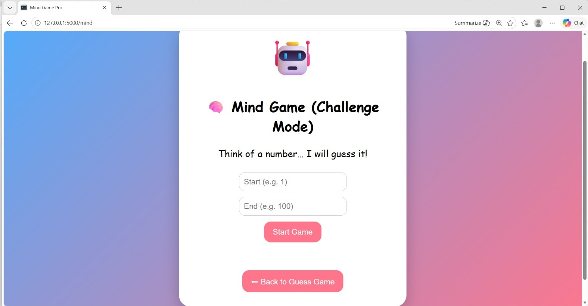
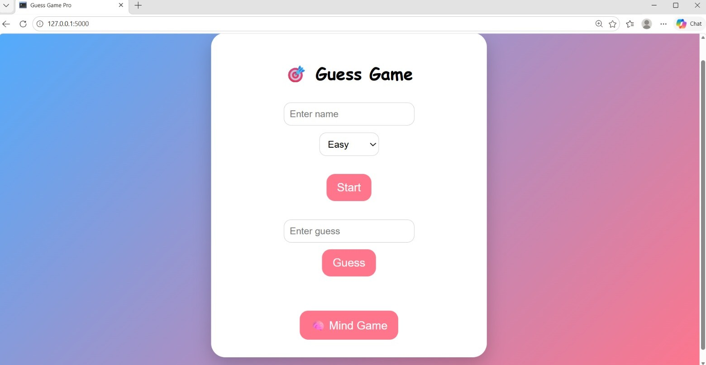

# 🎮 number-guessing-and-mind-reading-games

<h1>🎲 Number Guessing & 🧠 Mind Reading Games using Python, Flask, HTML, and CSS </h1>

<h2>Description</h2>
This project consists of two interactive Python-based command-line games.  
The first game is a number-guessing game in which the computer generates a random number, and the user tries to guess it within a limited number of attempts.  
The second game is a Mind Reading Game in which the user thinks of a number, and the computer intelligently guesses it using a binary search.
The project was initially developed as a command-line application and later enhanced into a web application using Flask and frontend technologies.

<h2>Technologies Used</h2>
<dl> 
  <dt>Frontend</dt> 
   <dd>HTML</dd> 
   <dd>CSS</dd> 
   <dd>JavaScript</dd> 
  <dt>Backend</dt> 
   <dd>Python</dd> 
   <dd>Flask Framework</dd> 
  <dt>Python Modules</dt> 
   <dd>Random module</dd> </dl>

<h2>Features</h2>

<strong>Number Guessing Game:</strong>

* Multiple difficulty levels (Easy, Medium, Hard, Custom)
* Limited attempts based on difficulty
* Smart hints based on closeness to the number
* Displays remaining attempts
* Interactive web interface
* Input validation for user entries

<strong>Mind Reading Game:</strong>

* The computer guesses the user's number
* Uses the Binary Search Algorithm for efficient guessing
* User provides feedback (Higher / Lower / Correct buttons)
* Displays total attempts taken
* Interactive gameplay through a web page

<h2>How to run the program </h2>

1. Make sure Python is installed

2. Run the files:
project-folder/
│
├── app.py
├── templates/
│   ├── index.html
│   └── mind.html
│
├── static/
│   └── script.js

 <h2>How to run the program </h2>
Make sure Python is installed
Install Flask
pip install flask
Run the Flask application
python app.py
Open the browser and visit:
http://127.0.0.1:5000

<h2>Output</h2>

